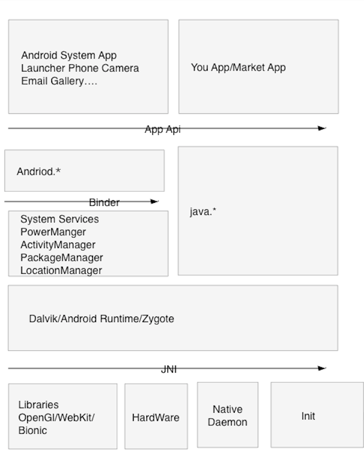
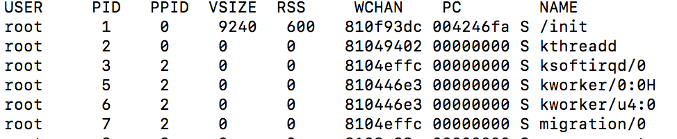
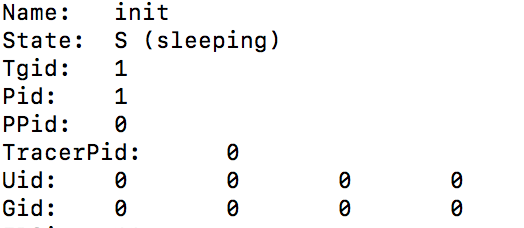
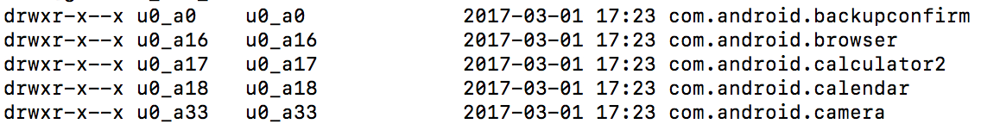
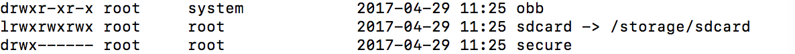

### Android架构

对于Android架构一般的理解会是，”在Linux上的Java“。然而，不准确，这样的描述直接忽略掉平台的复杂架构。

纵观全局，整个架构由五部分组成，包括Android应用层，Android Framework，Dalvik虚拟机，native code和Linux kernel。



#### 职能简介

- 应用层：允许开发者扩展与提升设备的功能，无需关注底层实现细节。
- Framework：提供丰富的API调用Android设备上的功能，是应用层与Dalvik虚拟机之间的粘合剂。包括管理UI元素，数据存储与应用间传递数据

上述两层都是使用Java开发并在Dalvik虚拟机上执行的。

- Dalvik：为操作系统特别设计的高性能抽象层，执行Dalvik Executable(DEX)文件。依赖于native层的libraries
- Native：包括系统服务如vold，Dbus；网络服务如dhcpd；其他库如WebKit何OpenSSL。其中一些服务会与内核级服务，驱动程序通信，另一则在调用上简化了底层实代码。

Android基于Linux内核做出很多额外的改动，例如获取相机，WIFI，网络，Binder和安全等。

### 安全模型

Android使用两套分离但互相配合的权限模型。

在低层级，Linux内核强制使用用户和用户组权限。这种权限模型继承自Linux，限制获取文件系统和Android特定资源的权限。一般被称为**Android's sandBox**(沙箱)。

在Android运行时，通过Dalvik虚拟机和Android Framework实现第二套模型，在用户安装应用时启用，限制了应用能获取的权限。一部分的权限直接对应了底层操作系统特定用户，用户组的权限。

#### Android‘s SandBox

Android基于Linux，而Linux继承了Unix著名的进程独立和最小特权法则。需要注意的是，进程作为独立的用户运行时，既不能与其他用户通信，又无法访问内存区域。

所以沙箱可以理解为几个概念：标准的Linux进程隔离，大多数应用的单独用户ID（UID），严格的文件系统权限。

Andoird定义了一系列的AndroidIDs（AIDs）来代替传统的用户和用户组的密码验证，通过补充组获取权限或共享资源，例如在sdcard_rw组的成员拥有读写/sdcard文件的权限。

除了文件系统的权限，补充组也用于获取其他权限。例如AID_INET组，允=允许用户打开AF_INET和AF_INET6套接字。

当应用运行时，UID,GID和补充组分配给一个新进程，操作系统不仅会在内核层级强制使用限制，还会在应用运行时进行控制，这就是Android沙箱。

在Android模拟器中，通过`ps`命令可以查看进程的PID。



通过`cd /proc/1`进入PID为1的进程内，`cat status`查看UID和GID。




#### Android权限

Android权限模型是多方面的，有API权限，文件系统权限和IPC权限。正如前面所说，高层级的权限会对应底层OS的功能，包括打开套接字，蓝牙设备，和特定的文件路径。

Android高层级权限声明在AndroidManifest内。应用安装时，PackageManager会将应用权限从Manifest中读取出来，存储在/data/system/packages.xml中。

通过`cat /data/system/packages.xml`可以找到系统Phone的UID及权限。

```xml
  <shared-user name="android.uid.phone" userId="1001">
        <sigs count="1">
            <cert index="1" />
        </sigs>
        <perms>
            <item name="android.permission.WRITE_SETTINGS" />
            <item name="android.permission.READ_SMS" />
            <item name="android.permission.READ_CALL_LOG" />
            <item name="android.permission.MODIFY_AUDIO_SETTINGS" />
            <item name="android.permission.SYSTEM_ALERT_WINDOW" />
            <item name="android.permission.SEND_RESPOND_VIA_MESSAGE" />
            <item name="android.permission.SHUTDOWN" />
            <item name="android.permission.INTERNAL_SYSTEM_WINDOW" />
            <item name="android.permission.BROADCAST_SMS" />
            <item name="android.permission.CALL_PRIVILEGED" />
            <item name="android.permission.CHANGE_NETWORK_STATE" />
            <item name="android.permission.RECEIVE_BOOT_COMPLETED" />
            <item name="android.permission.DEVICE_POWER" />
            <item name="android.permission.RECEIVE_SMS" />
            <item name="android.permission.SET_TIME_ZONE" />
            <item name="android.permission.BLUETOOTH" />
...
         </perms>
    </shared-user>
```

这些权限会在应用进程实例化时（例如设置补充GIDs时）授予。

用户组的权限存储在/etc/permissions/platform.xml中，用于确定应用的补充组GIDs。

通过`cat /etc/permission/platform.xml`查看。下面列举存储权限。

```xml
    <permission name="android.permission.READ_EXTERNAL_STORAGE" >
        <group gid="sdcard_r" />
    </permission>

    <permission name="android.permission.WRITE_EXTERNAL_STORAGE" >
        <group gid="sdcard_r" />
        <group gid="sdcard_rw" />
    </permission>

    <permission name="android.permission.ACCESS_ALL_EXTERNAL_STORAGE" >
        <group gid="sdcard_r" />
        <group gid="sdcard_rw" />
        <group gid="sdcard_all" />
    </permission>
```

这些权限会以下列两种方式之一强制执行：运行时调用方法时进行判断，底层操作系统或内核检查。

##### API权限

API权限包括用于控制在API/frameword中高层级的功能和第三方框架。例如公用API权限READ_PHONE_STATE，在文档中定义为“仅允许读取电话状态”。需要该权限的应用要在调用任何与电话状态相关的API之前获取授权。相关方法在`TelephoneYManager`中，像getDeviceSoftwareVersion, getDeviceId等。

##### 文件系统权限

Android应用沙箱由Unix严格的文件系统权限控制。UIDs和GIDs授予了访问各自文件系统内的存储空间。

通过`ls -l /data/data`查看，UIDs和GIDs（第二，第三列）在列表中是独一无二的，而且再看权限只有特定UIDs和GIDs才能访问其中内容。



正如前面提到的，特定的补充GIDs用于获取共享资源，例如SD卡或外置存储。

通过`ls -l /mnt/`查看sdcard读写权限。



