## 缓存相关

Glide除了内存缓存和磁盘缓存，还有Bitmap对象池和ArrayPool的使用，其中大多使用LRU的思想。

### 预备计算工作

先判断设备是否低内存设备

`MemorySzieCalculator.isLowMemoryDevice`

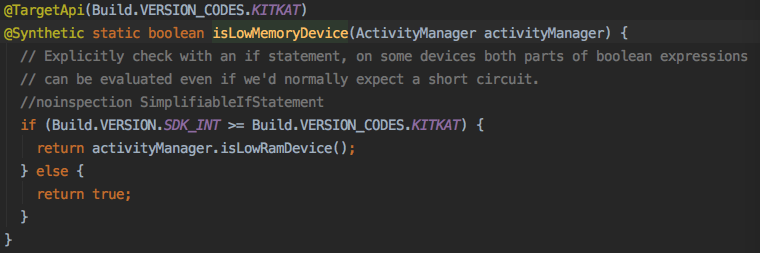

获取Glide框架能使用的最大内存大小，通过取到每个应用最大能用的内存大小 * 比例参数

`MemorySizeCalculator.getMaxSize`

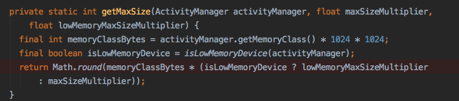

计算屏幕的字节大小 = 宽 * 高 * 4字节（ARGB 8888），计算Glide使用内存大小和Bitmap池大小，若两者相加大于Glide框架能使用的最大内存则乘比例参数，否则返回。

`MemorySizeCalculator`

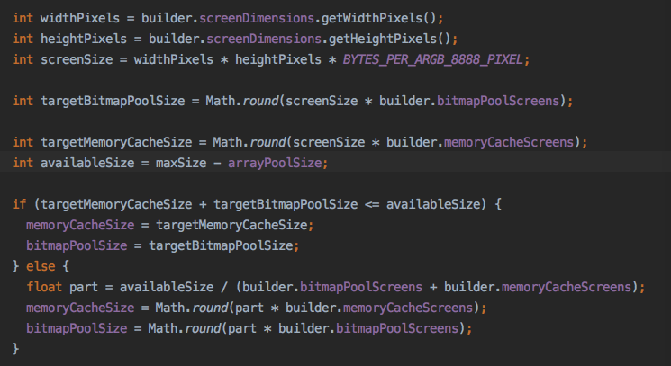

### Bitmap缓存池

缓存池实现BitmapPool接口，用于重用Bitmap对象，真正实现类是LruBitmapPool。

需要实现的方法比较少，一个个看。

`LruBitmapPool.getMaxSize`

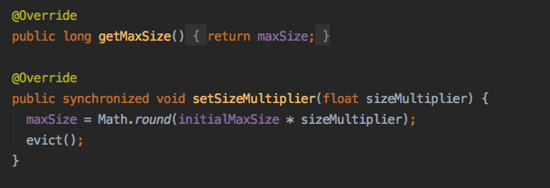

前两个比较简单，maxSize就是上面算出来的值，setSizeMultiplier把maxSize乘一个因子，根据结果将对象释放一部分。evict方法很简单，移除队尾最少使用的Bitmap并recycle，计算CurrentSize是否比maxSize大，大则继续。

`LruBitmapPool.put`

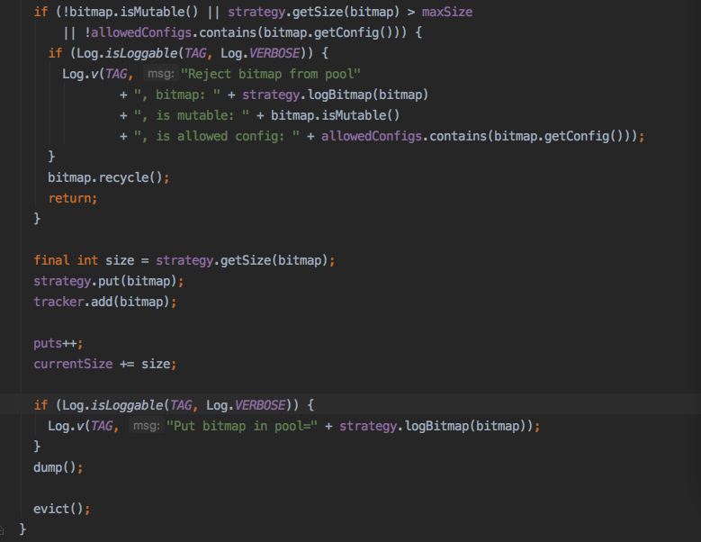

先检查Bitmap状态，是否可变，大小是否很大，config内容。都可以把Bitmap添加到队列里，计算大小，并evict。

`LruBitmapPool.get`

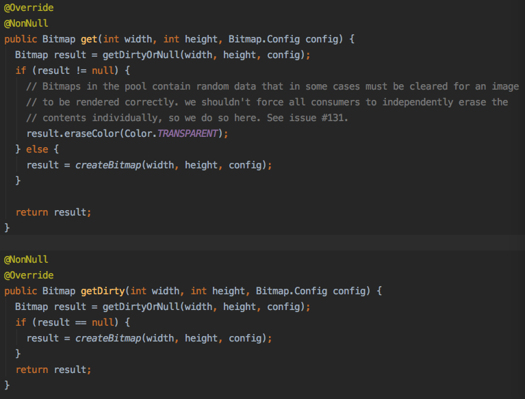

两个方法大同小异，所谓getDirty比get效率高，就是get方法多做了一步eraseColor。

`LruBitmapPool.getDirtyOrNull`

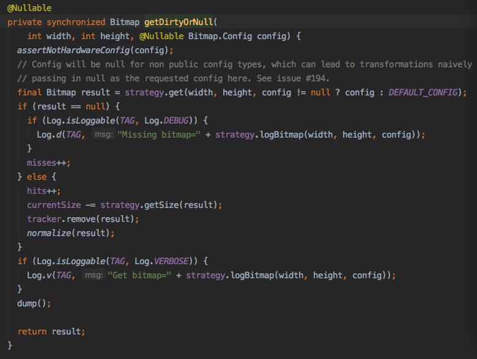

strategy在Android 4.4及以上是SizeConfigStrategy，否则是AttributeStrategy，区别在于Bitmap大小计算方式不尽相同，这里以SizeConfigStrategy为例，看get方法。

`SizeConfigStrategy.get`

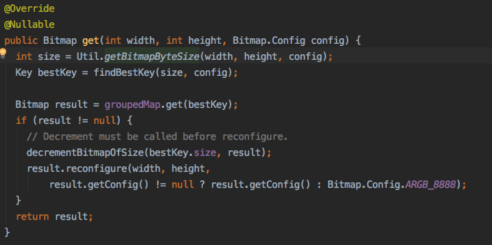

SizeConfigStrategy拥有一个keyPool，可以简单看做size为20的ArrayDeque<Key>。一开始findBestKey从这个空队列中创建一个Key，Key由Bitmap的大小和Config组成，通过Key从groupedMap中取到大小相等，Config相同的Bitmap。

findBestKey方法内有几个变量，其中sortedSizes是个以Config为key，NavigableMap为值的HashMap，这个NavigableMap又是以Bitmap大小为key，这个大小的Bitmap的数量为值的TreeMap。这个设计用于，当需要取特定Config的Bitmap缓存时，可以在O(1)时间复杂度内取到TreeMap对象，接着取到特定大小的Bitmap则需要O(lgN)的时间复杂度，加起来是O(lgN)的时间复杂度。

从缓存中拿的result不为空时，要先减掉相应config切相应大小的Bitmap计数，最后调用reconfigure进一步减少Bitmap宽高，返回给外层。注意这里获取到的Bitmap的像素值是不靠谱的，需要调用者进行重绘，这里主要是重用Bitmap对象，所以方法名为getDirty。

LruBitmapPool.getDirtyOrNull减少当前计数结束。

`LruBitmapPool.clearMemory`

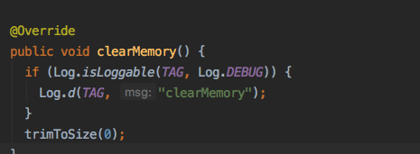

循环删除缓存列表直到0。

`LruBitmapPool.trimMemory`

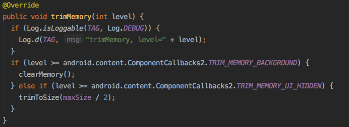

简单，不解释。

总结一下对象池的作用。频发的GC是会影响帧率和应用的流畅体验的，因为GC是需要stop the world来执行的。GC发生的场景很多，例如分配新对象，定时触发等，而分配大而连续的内存和很多零碎的生命周期短的小对象则必会触发GC。对象池减少了生成和回收对象的频率，也就是减少了GC的频率，由于是按需生成且存在缓存，所以原则上，只要及时清理缓存，是不会造成内存浪费的。

### 内存缓存

具体实现类时LruResourceCache，继承了LruCache，实现了MemoryCache接口，是对添加或删除Resource内存缓存的抽象，其实现就是LruCache的思想，不细说。

多出了ResourceRemovedListener接口用于当Bitmap被移除出缓存进行通知，调用ResourceRecycler.recycle进行回收。

总结一下内存缓存池的作用，在Resouce被release时会以键值对的形式放入内存缓存池，如果这时有同样key的可以直接从内存缓存池中取出（即State为Active的Resource）。当放入内存缓存池时，大小超出限制，则取出队尾的Resource，并调用其recycle方法，对于BitmapResource而言，recycle方法就是调用bitmapPool.put方法。

### 磁盘缓存

磁盘缓存默认实现是DiskLruCacheWrapper，由InternalCacheDiskCacheFactory.build生成，默认大小为250MB，位置为/data/data/包名/image_manager_disk_cache。

DiskLruCacheWrapper实现DiskCache接口，是读写磁盘的抽象。先看get和put方法的实现。

`DiskLruCacheWrapper.put`

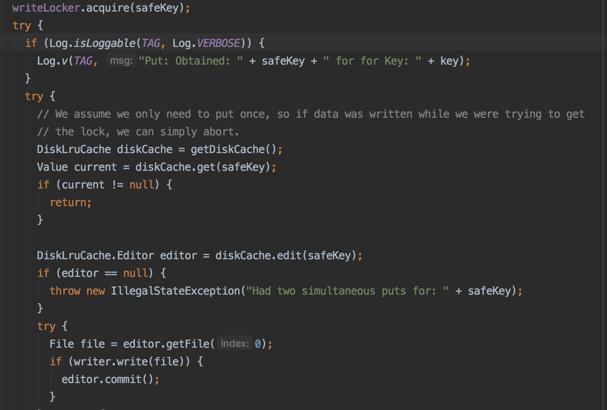

先获取写锁，同时只能有一个写操作，在finally中释放。

构建出DiskLruCache，开始读取journal，即对磁盘缓存的操作记录，构建出lruEntries。刚开始只存在一个空白的journal文件。

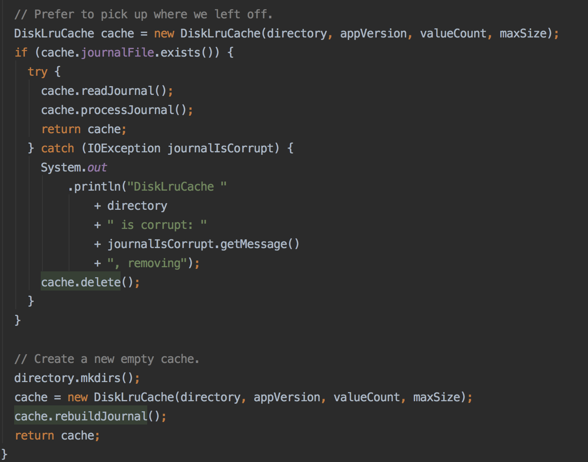

方法开始先检查有没有journal.bkp和journal并存，以journal为准（何为jornal请翻上面的注释）。

若diskCache.get方法返回不为null，则表示已有缓存，直接返回。

不存在则构造一个Editor对象，为它赋值DIRTY表示正在写入。

由上篇可知，图片加载完成后会调用DiskLruCacheWrapper.put -> DataCacheWriter.write -> BitmapEncoder.encode方法，将Bitmap写入文件。这个文件以key.tmp值作为名字。

最后调用commit，若写入成功将文件重命名为key，在journal记录一条CLEAN的操作，失败则删除旧文件，记录一条REMOVE的操作。 

`DiskLruCacheWrapper.get`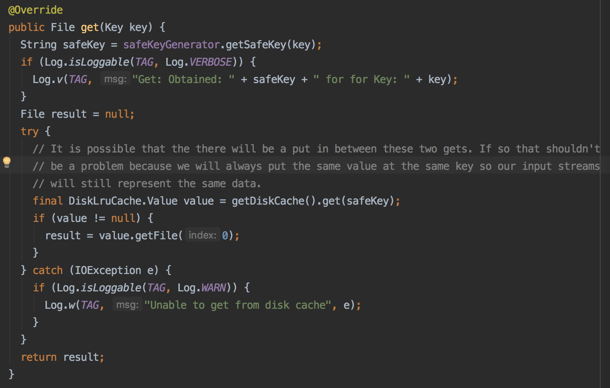

知道了DiskLruCache的put原理，get方法就很简单了，根据key取到响应的文件，由于键值对是1：1关系，所以去index为0的File，存在则返回。

### LruArrayPool

默认大小4MB，用于存放byte/int数组的对象池。例如用于BitmapFactory.Options.inTempStorage的值，是指定解码过程的缓冲区大小。

`DownSampler.decode`

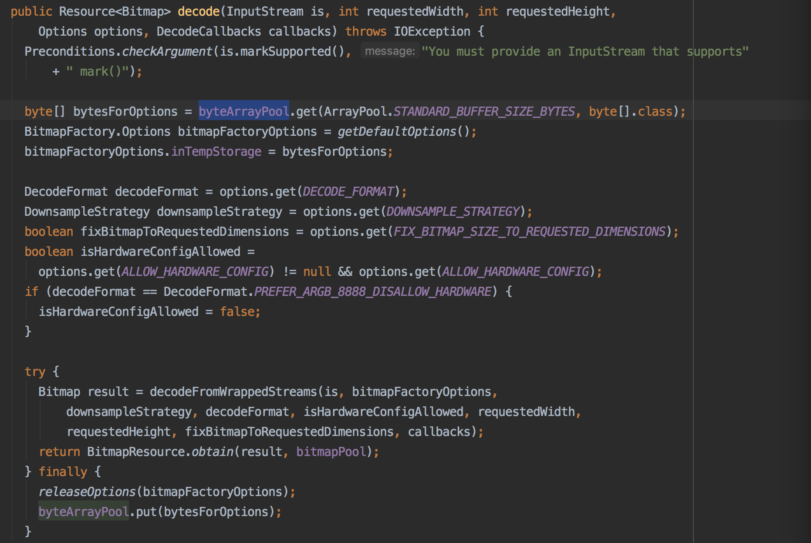

在decode方法内，通过byteArrayPool.get一个64KB的byte数组，赋值给BitmapFactory.Options.inTempStorage，在finally中调用byteArrayPool.put放回池内。

`LruArrayPool.get`

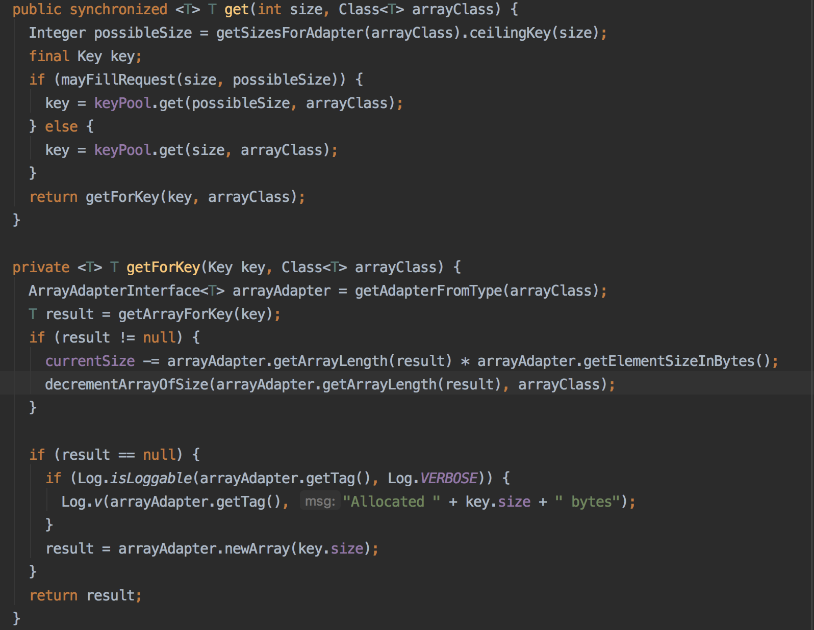

先根据arrayClass(byte[].class/int[].class)和size生成Key，用Key去取相对应的byte[]/int[]，若result不为null，再根据ArrayAdapter(ByteArrayAdapter/IntArrayAdapter)计算大小，减少currentSize的大小，decrementArrayOfSize将相对应的类型和大小的数组的数量减1。

`GroupedLinkedMap.get`

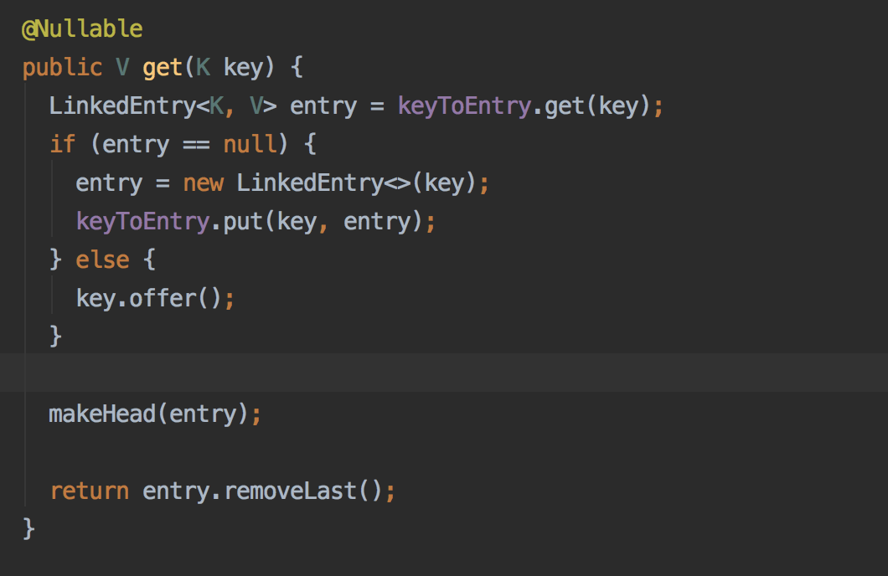

当Key对应的Entry不存在时则新建一个，否则将key插入Key池内，将Entry作为链表头。LinkedEntry内的values是一个List，用于存放Key所对应数组(byte[]/int[])，是在GroupLinkedMap.put方法中add进去的。

总结一下，ArrayPool是一个全局的数组池，它可以放置不同类型的数组，具有限定大小的同时，使用LRU策略保持顺序。

## 总结

内存缓存和磁盘缓存的使用，大大提升了加载的速度，而对象池的使用则减少了大量的内存分配和回收的操作，减少GC的发生，提升了吞吐率。