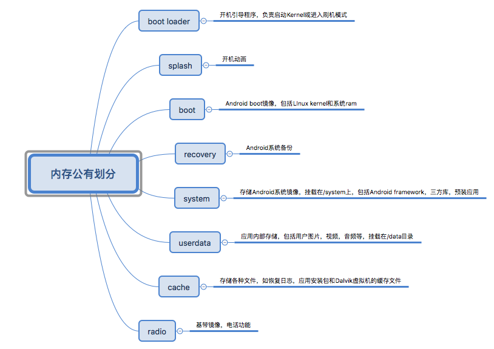

需要最高权限的理由很多，例如本文的目的在于不通过授权的方式更改Android设备的安全设置。也有很多人想更改默认系统行为，修改自定义主题和开机动画。Rooting可以卸载厂商预装软件，备份恢复整个系统或者加载自定义的kernel镜像。很多典型的管理型app都需要root权限，如防火墙，广告拦截和超频器。

不论root的理由是什么，都降低了设备的安全性，root可以通过最高权限获取用户数据，更可怕的是，当手机遗失，被偷掉或被卖掉，是存在被破解的可能的。

### 设备内存划分

设备的内存是根据逻辑储存单元来划分的，通过boot加载脚本来指定划分层级。根据不同厂商，机型，划分的层级会各有差异，但某些特定层级是公有的。




#### Boot Process

boot通常是设备启动时运行的第一个程序。对于大多数设备而言，boot启动了底层级的初始化，如设置计时器，内部RAM，启动多媒体等。boot本身由多个部分组成，这里我们把它当做一个整体看待。

boot初始化硬件设施完成后，战场从引导分区进阶到内存级别，轮到Android Kernel接过boot的最后一棒，它完成了Android 系统执行所需要的一切任务，包括初始化内存和I/O机制，中断处理，CPU调度，设备驱动等。最后，它把根目录挂载，启动user-space进程init，就陷入了沉睡中。

init进程是其他user-space进程的父亲。它开始动手了，根据/init.rc，这本由创造它的程序员写成的天书，开始初始化user-space的组件，包括Android核心服务如rild电话服务，VPN和adbd。其中一个更广为人知的孩子Zygote，创建了Dalvik虚拟机并繁育了第一个Java孩子，System Server。最终Android Framework的服务也被开启了。

整个开天辟地过程就结束了。

我们来看一下天书init,rc所写

```xml
on init
...
    # setup the global environment
    export PATH
/sbin:/vendor/bin:/system/sbin:/system/bin:/system/xbin
    export LD_LIBRARY_PATH /vendor/lib:/system/lib
    export ANDROID_BOOTLOGO 1
    export ANDROID_ROOT /system
    export ANDROID_ASSETS /system/app
    export ANDROID_DATA /data
    export EXTERNAL_STORAGE /mnt/sdcard
...
on property:androVM.inited=1
    class_start core
    class_start main
...
service servicemanager /system/bin/servicemanager
    class core
    user system
    group system
    critical
    onrestart restart zygote
    onrestart restart media
    onrestart restart surfaceflinger
    onrestart restart drm
...
service zygote /system/bin/app_process -Xzygote /system/bin --zygote --start-system-server
    class main
    socket zygote stream 666
    onrestart write /sys/android_power/request_state wake
    onrestart write /sys/power/state on
    onrestart restart media
    onrestart restart netd
...
```

系统boot完成后，会发出一个[ACTION_BOOT_COMPLETED](https://developer.android.com/reference/android/content/Intent.html#ACTION_BOOT_COMPLETED)的广播，任何注册接受这个广播的接收器都能收到。

#### 刷机模式

按住某几个特殊的键可进入刷机模式。它是储存在低层级的一个叫flashing的进程所启动，支持USB连接，通信的。

### boot的锁

为了防止中断用户篡改系统固定，boot是被厂商加锁的。消费者对厂商的不信任，对预装软件的厌恶，对追求极致性能的欲望，助长着刷机风气的日渐嚣张，许多厂商被迫放出boot的解锁步骤，甚至很多大厂纷纷出产一键root工具。

解锁boot的难度愈发降低，只需简单得工具，一台手机都能轻松地获取root权限。root权限带来了严重的安全隐患，由于其特殊性，root可以获取所有应用的用户数据，账户信息，秘密文件，交易详情，私密图片等，所以应用的开发者对各种敏感数据需要进行加密，普通用户在换新手机的时候，不要忘了将旧手机恢复出厂设置并清除用户数据，使得别有用心的攻击者难以得逞。

### 备份恢复

备份恢复系统是Android标准机制，在不需要擦除用户数据的前提下，进行系统更新。这样的恢复操作必须进行重启。

恢复镜像通常存储在recovery层级里，作为最小的Linux镜像，它的功能十分有限，通常是一个ZIP包里面的一些元数据和更新脚本。

### 总结

Root机器能获取设备的至高权限，同时也存在着被攻击的隐患。本文主要介绍了内存划分的几个概念和boot机制

