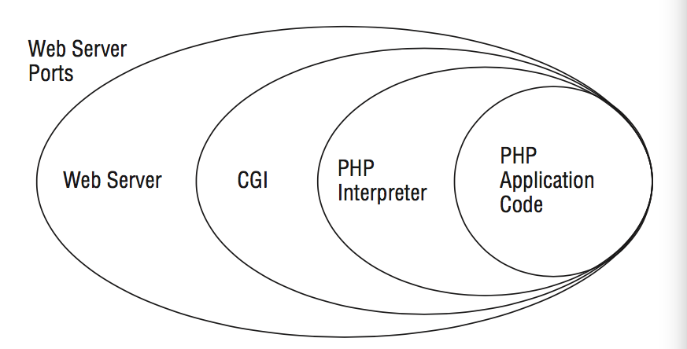
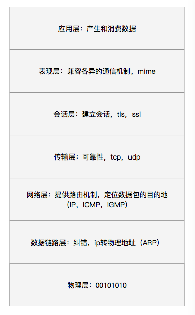

最好的安全者往往是最危险的攻击者。

彻底了解攻击手段的多样性是攻击或防御成功的关键，无论对于Android或者是其他系统，情况大抵类似。而每个黑客的目的就是通过研究未披露的漏洞，分析其用于攻击的可能性，相反，白客就需要了解每种可能入侵系统的方式。所以，了解攻击手段是首要任务。

### 攻击向量

攻击向量是实施攻击的方法，简单来说，就是接触到恶意代码的行为。攻击向量通过三项标准来评估漏洞和攻击的可行性：

- 认证
- 可访问性
- 难度

例如，给目标发送电子邮件是一种高级的攻击向量，它不需要任何认证手段，只需要简单点击就能执行恶意代码。另一个例子是网络监控，认证同样也是不必要烦人，但依赖于监听网络提供的服务是否有漏洞。

进一步细分攻击向量：

- 点击url
- api漏洞

上述邮件的例子就是通过点击一个url来执行恶意代码。另一个就是通过API漏洞实施攻击，例如sql注入漏洞。

任何能利用来执行恶意代码的**手段**都可以称为向量。

### 攻击面

攻击往往只会发生在系统最脆弱的侧面。在物理层面上看，攻击面会是目标暴露出来未有防御的一面（有时大型攻击面会是烧服务器，光纤等）。从技术角度来看，攻击面是描述了代码未被发现的脆弱性。在邮件的攻击中，攻击面可能攻击是邮件服务器中的解析器，又或是在目标机器上呈现某种信息。在对浏览器的攻击中，所有与浏览器相关的技术都可能是攻击面，例如HTTP，HTML，CSS，SVG。

记住，攻击面不仅仅是依赖漏洞才存在，只要是攻击者能执行的任何代码都被视为攻击面。

与攻击向量的不同在于，以Android设备作为攻击目标，无线网络可能是一个攻击面，相反，某个特定的功能或API可能被视为攻击向量。

下一节讨论的网络概念中，因特网被分为几个层次，数据在每层传递时候都暴露了不一样的攻击面。

系统最外层的攻击面可以是由两个web server通信端口组成。如果攻击向量是某个未加密的请求，带有不受信任的数据发送到指定的php应用内。那对于服务器和客户端的潜在攻击面就容易成功。

最后注意一地那，一个攻击面可能由多个攻击向量组成，一个对于图片加载API的攻击面可能通过电子邮件，网页和应用的即时信息这些攻击向量来达到。

###  攻击面分类

攻击面与系统组成成正相关，系统的代码，硬件，用户，操作系统都需要考虑。市面上很多Android设备的功能都是一应俱全的，同时也导致了攻击面的多样化，因此下面来对攻击面进行分类。

#### 属性

一般会有下面几个关键属性可供参考。

- 攻击向量

- 提权 - 攻击面可能需要root权限执行命令
- 内存安全 - 对于C和C++并不是内存安全语言可能更脆弱
- 复杂性 - 复杂的代码，算法和协议更可能存在漏洞

下面从最吸引人，最致命的攻击面开始

#### 远程攻击

远程攻击不会发生在目标物理地址的附近，而是通过计算机网络进行攻击。

从点击一个有毒的url（或者在地址栏敲入一个有毒的地址），网络蠕虫就可以开始增殖了。除此之外，攻击者还可以在网络中处于有利位置（假扮服务器）来实施中间人攻击，例如谷歌镜像。

要实施远程攻击就需要了解更多网络的概念。

#### 网络概念

家用机和移动设备存在于网络的最外层，在这些网络节点之间是路由器。当一台移动设备链接到某个网页时，一连串使用各种协议的数据包就通过网络来定位，通信，与服务器交换数据。蜂窝网络与此类似，通过与最近的信号塔通信，当用户走动的时候，信号塔也随之改变，信号塔是移动射击接入网络的第一站。

##### OSI模型

- 物理层：两台计算机交流0和1，部分以太网和WIFI在这层
- 数据链路层：添加了数据纠错能力，剩余的以太网和WIFI，还有想LLC和ARP协议
- 网络层：提供路由机制让数据包知道具体的目的地
- 传输层：增加了可靠性传输
- 会话层：为主机间建立对话
- 表现层：兼容数据差异性
- 应用层：DNS,DHCP,FTP,SNMP,HTTP,SMTP等

#### 网络配置与防御

现代网络不同于1980年，那时互联网是公开透明的，主机之间可以互联，彼此都是可信的。通过几次血的教训，防火墙开始建立起来了。1999年NAT开始用来创建一个私有网络；在2013年，ipv4的地址快要消耗殆尽，NAT缓解了压力。简单地说，NAT路由器扮演了一个透明代理的角色，它连接了WAN（外网）和LAN（局域网），同时也成为了一种防火墙，外网只能通过NAT路由器发送响应，而不知道内网的组成。

#### 邻接

网络中，两个相连的主机关系称为邻接。攻击者可以通过攻占LAN内的主机实现邻接，说好的有防火墙呢？有VPN啊。又或者直接侵占NAT路由器。当攻击者成功后，它就成为目标与外网之间的中间人。

在内网中，网络点之间是直接相连的，没有路由器的参与因此IP也无从谈起，更不用说协议验证。数据传输的方式往往是在广播，根据MAC地址送达，而某些局域网配置是可以监听网络请求的。

事实上，没有任何验证协议的网络是很容易被欺骗的。例如在某个欺诈攻击中，攻击者伪造了数据包的源地址，伪装发送给其他主机，骗到真实的回复。这种攻击大多数发生在网络层以下，通过ARP或ARP缓存欺诈，只存在于数据链路层。

对于ARP欺诈最有效的防御措施是使用静态ARP表。其他类似的攻击还有DNS和DHCP的。

### 移动技术

对于移动设备而言，网络攻击除了上述形式外，也另有花样。攻击面会是SMS和MMS服务。这些点到点类型的服务通过蜂窝网络传递，所以没有网络邻接和用户交互的行为。

一种有意思的攻击方法是，基于WAP发送富文本短信。WAP协议是基于SMS协议，可扩展的推送服务。其中有一种实现是Service Loading request（或称WAP push），当这种消息推送到手机上时，不需要用户任何的操作，手机会自动处理下发的信息，例如打开默认浏览器打开某个url。

2012年，研究员Borgaonkar在三星设备上实施过这种攻击。他通过WAP推送信息唤醒手机的USSD服务（比如输入*#会触发一些预设定的命令），下发一个链接`tel://url`，浏览器打开该链接后会自动打开拨号界面。通过拨号界面修改手机的PUK码，由于SIM卡得PUK一旦输错超过10次，该SIM卡就会报废，这种攻击的目的在于破坏SIM卡。

### 总结

攻击=攻击面+攻击向量

攻击向量通过认证，可访问性和难度进行评估。攻击面大多选取系统薄弱处，例如无线网络的底层协议。

