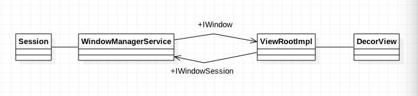
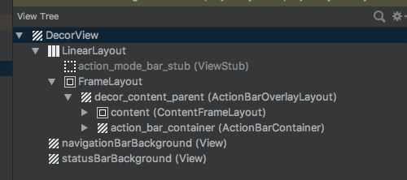
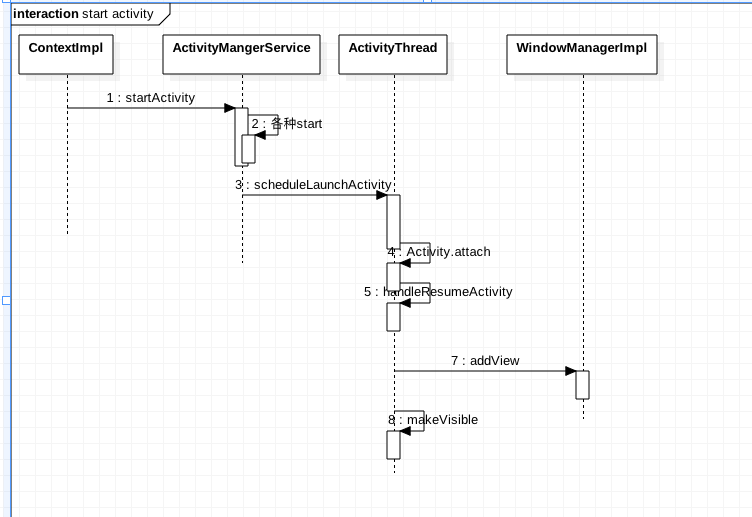
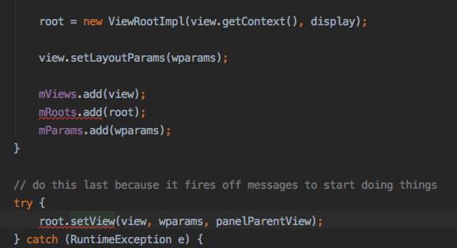
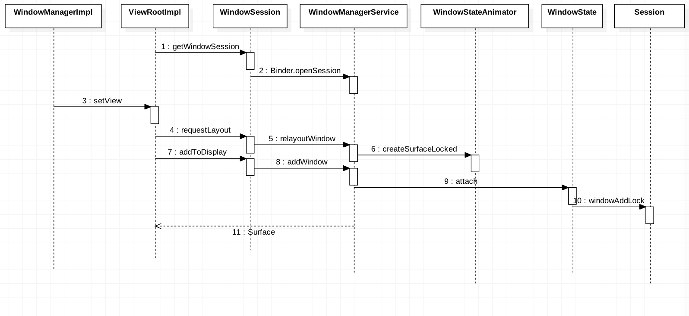
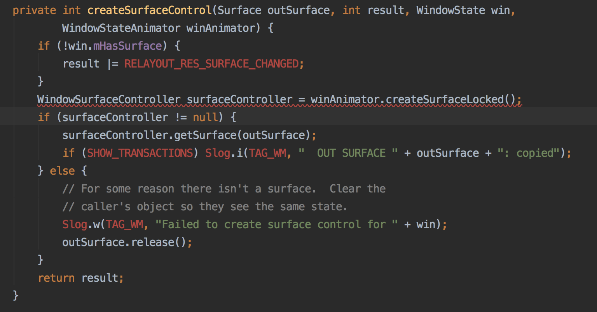
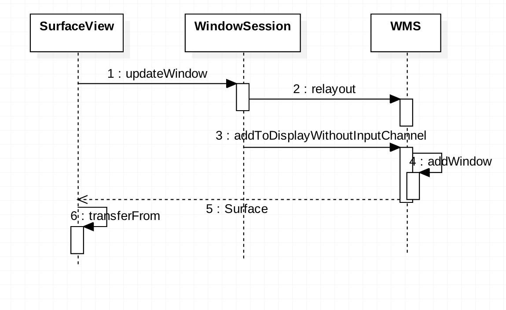
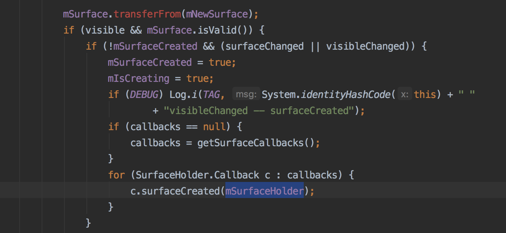

本文梳理了Activity、View、Window、ViewRoot、Surface、AMS、WMS之间的关系，由于跳转间的流程纷繁复杂，一旦陷入代码细节就难以自拔，下文中分析省略掉很多细节，想了解的可以阅读源码或者阅读相对应的书籍。

### 概念定义

ContextImpl：Context实现类。

PhoneWindow：Window唯一实现类。Window是一个抽象概念，是添加到WindowManager的根容器。

ViewRootImpl：ViewRootImpl是View的根，它控制了View的测量和绘制，同时持有WindowSession通过Binder与WMS通信，同时持有IWindow作为WSM的回调接口，用于例如touch事件的回调。

WindowManagerImpl：WindowManager和ViewManager的实现类，通过WindowManagerGlobal与WMS通信。

DecorView：继承FrameLayout，是视图树的根布局。

使用AS自带的tools/layout inspector可以看出，整个DecorView包含了三部分：navigationBarBackground为导航栏，statusBarBackground为状态栏，LinearLayout为当中内容部分，展开LinearLayout.FrameLayout，可以得到action_bar_container即actionbar或toolbar和content（R.id.content）即真正setContentView的目标。

下文中但凡遇到抽象类/接口，都直接用实现类替代，而 -> 符号代表由函数跳转到另一函数。

### 从启动Activity说起

第一个部分是启动Activity到创建出ViewRootImpl。

从ContextImpl开始，省略掉AMS里相关跳转到最后ActivityThread.performLaunchActivity -> Activity.attach中创建出PhoneWindow。

继续下一步调用方法 ActivityThread.handleResumeActivity -> WindowManagerImpl.addView创建出ViewRootImpl。

ViewRootImpl的构造方法内创建了WindowSession(Binder)，通过它与WindowManagerService进行通信。

小结：启动Activity会创建ViewRootImpl和PhoneWindow，建立起与WMS的连接。

### 与WMS通信

第二步是ViewRootImpl与WMS通信。

接上第一步中在ViewRootImpl构造方法中通过WindowSession -> Binder.openSession构造出WindowSession。

由第一步7中WindowManagerImpl.addView -> … ->WMS.relayoutWindow根据Window测量的大小相对应创建出SurfaceControl，通过SurfaceControl.getSurface将测量结果写入outSurface内，此处的outSurface就是ViewRootImpl.mSurface，注意此处只有大小，还未有指向native surface的指针mNativeObject。

由第一步7中WindowManagerImpl.addView -> … ->WindowState.attch，创建出WindowToken用来标识Window类型，如子窗体（1000~1999），应用窗体（1~99）和系统窗体（2000~2999）。再创建WindowState——WMS端的Window对象，它持有Session与WindowManager通信，更重要的是调用Session.windowAddedLocked创建出SurfaceSession。

SurfaceSession构造方法里调用了nativeCreate，从这里开始就是native的世界，不是本文重点，但简单概括一下流程是通过创建SurfaceComposerClient与SurfaceFlinger进行交互，锁定一块共享内存，通过writeParcel返回给ViewRootImpl.mSurface，同时拥有了native surface的地址。

小结：当Activity准备显示时，会测量Window和添加Window，创建出WMS服务对应的WindowState，Surface和native Surface。

### 绘制

绘制四要素：bitmap（一块内存保存像素），canvas（画布用于画像素），paint（画笔），path（画的对象）。

应用无论是使用View/Canvas绘制（软件绘制，Skia），或者使用硬件加速绘制，最底层都是与Surface（OpenGL）进行交互。

再回到Activity的生命周期onCreate，调用setContentView创建一个不可见的DecorView，当ActivityThread.handleResumeActivity -> Activity.makeVisible设置DecorView为可见。

其中绘制的起点是ViewRootImpl.performTraversals -> ViewRootImpl.performMeasure -> ViewRootImpl.performLayout - > ViewRootImpl.performDraw调用作为根视图DecorView的measure，layout，draw方法来遍历视图树。

值得一提的是FrameBuffer的知识点，开始绘制时，会调用Surface.lockCanvas，由SurfaceFlinger锁定一块共享内存传递给Canvas，内存共享的是设备显存，在上面绘制相当于在屏幕上绘画。绘制结束调用Surface.unlockCanvasAndPost，从Suface上detach掉canvas，释放Surface。

### 触类旁通之SurfaceView

SurfaceView会创建一个Z轴靠下的新Window，通过挖洞（重叠区域变透明）使自己可见。

观察一下SurfaceView的内部结构，似乎和ViewRootImpl差不多，同时持有IWindowSession，Surface和MyWindow（同ViewRootImple.WindowSession）

relayoutWindow，addWindow，Surface一气呵成，流程比较简单，注意一下SurfaceHolder，一般使用SurfaceView时候都是操作SurfaceHolder.Callback，它作为内部类一开始就创建出来了，而在native surface创建完毕之后调用SurfaceHolder.Callback.surfaceCreated。

### 总结

Activity启动时除了通过ViewRootImpl读取各个参数确定Window的大小，位置等等，通过WMS创建出相应大小的Surface和一块共享内存，等待DecorView通过Canvas绘制画面。

### 参考资料

Android 7.1.1 源码

Android官方文档

《Android开发艺术探索》

《深入理解Android 卷1》

其他优秀的中英文文章