### 概述

画2D图形有两种方法：

- 把图片和动画画到View对象里，整个绘图过程由系统的视图树处理，我们只需要定义好图形。适合于不需要动态改变的简单图形，如静态图片和定义好的动画
- 在Canvas上绘图。在类的ondraw方法内获取Canvas，或者调用Canvas.drawXXX方法。适合重复重绘自己的图形，如视频。既可以通过自定义View通过invalidate，在UI线程里回调onDraw方法，也可以通过SurfaceView启动别的线程调用invalidate。

### 用Canvas绘图

Canvas实际上是封装了各种draw方法的类，调用draw方法把图形绘制到底层的Surface上，即绘制在Window上。

- 在onDraw方法里使用Canvas绘制比较简单，不再赘述。
- 在SurfaceView通过lockCanvas获取Canvas，同上。
- 自定义Canvas，根据文档所写，创建Canvas时，需要设置一个Bitmap。理解一下Bitmap，有一个内存指针mNativePtr和一些属性，可以简单视为一小块内存。从[前篇](https://www.jianshu.com/p/a7596afb1aa1)知道，绘制其实是写一块共享内存，而Bitmap可视为共享内存的一小块。

这个例子中构造了两个Canvas和一个Bitmap，分别调用其draw方法，先是mCanvas往Bitmap里绘制一个方块，再在onDraw方法内调用canvas.drawBitmap绘制这个方块。

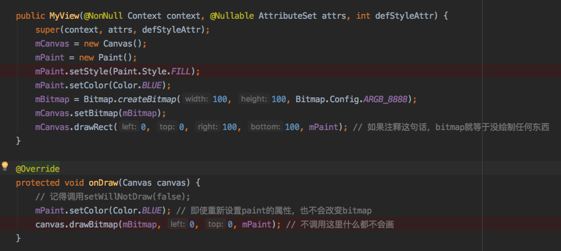

思考一个问题，为什么mCanvas需要设置Bitmap？

很简单，因为它没有。来看一下draw的起点ViewRootImpl（软件绘制，不开启硬件加速下）。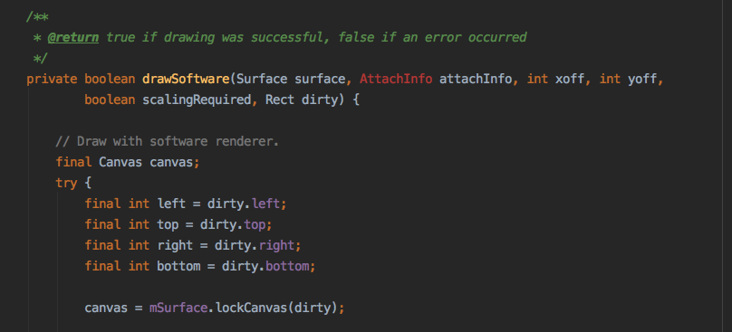

这个通过mSurface.lockCanvas返回的Canvas是View.draw的canvas变量，所以当1，2情况时，Canvas都持有一个Bitmap，指向共享内存里的某一小块，当调用Canvas.draw方法时就能绘制出东西。但对于自定义Canvas来说并不是，即使设置一个Bitmap和绘制了Bitmap，但不往共享内存上写，屏幕上是不会显示的，SurfaceView同理，通过Surface.lockCanvas获取持有共享内存的Canvas，绘制完毕后调用Surface.unlockCanvasAndPost把绘制内容显示到surface上并release掉Canvas。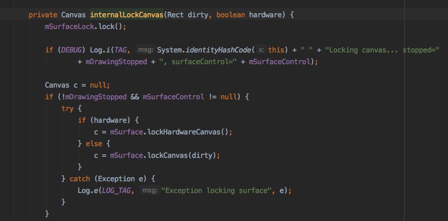

顺带一提Canvas.save和Canvas.restore方法，如下Demo

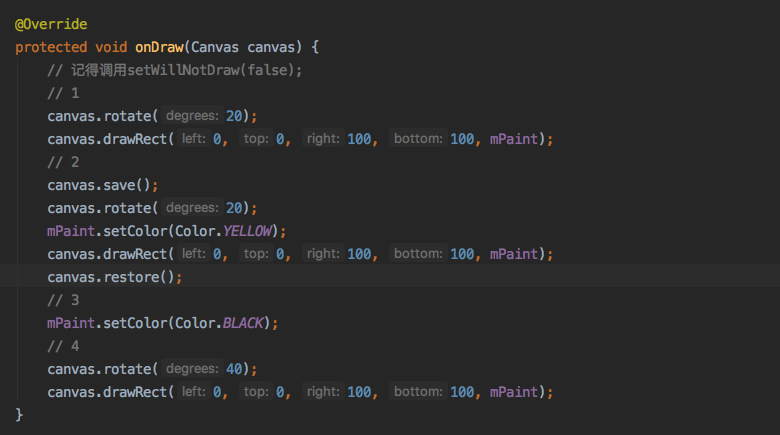

效果图如

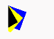

画的是三个颜色和旋转角度都不同的小方形。

步骤1把默认坐标系旋转20°，画出第一个蓝色的方形，步骤2保存当前的matrix（旋转了20°），继续旋转20°，此时坐标系已经旋转了40°，画出第二个黄色的方块，步骤3，恢复上一步保存的matrix（旋转了20°），此时坐标系还是旋转了20°，步骤4，再旋转40°，此时坐标系旋转了60°，画出第三个黑色方块。

Canvas.save用于保存当前matrix和clip，Canvas.restore用于恢复上次保存的matrix和clip。

### Drawable

Drawable是一个能画出来的物体的抽象，使用前需要调用setBounds确定位置和大小，通过getIntrinsicHeight和getIntrinsicWidth取到实际大小。Drawable可以有几种形式存在：Bitmap、Nine Patch、Vector、Shape、Layers等。

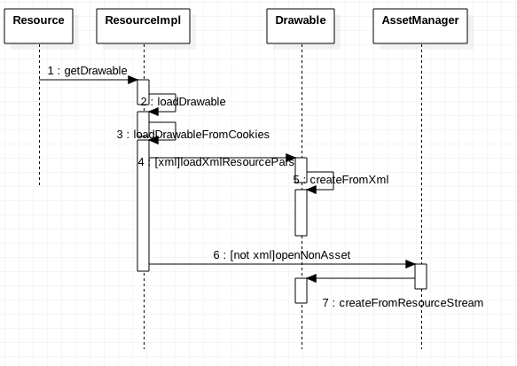

从Resource.getDrawable会判断是否.xml结尾，不是的话走6，7步，如果从xml中读取，需要getResource.getDrawable -> ResourceImpl.loadDrawableForCookie -> drawable.createFromXml -> DrawableInflater.inflateFromXmlForDensity -> drawable.inflateFromTag

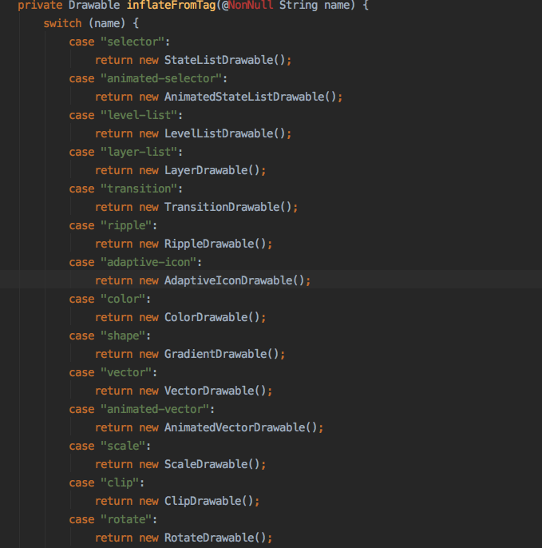

看一下Shape实现类GradientDrawable的inflate实现，读取各项属性并赋值，到draw方法。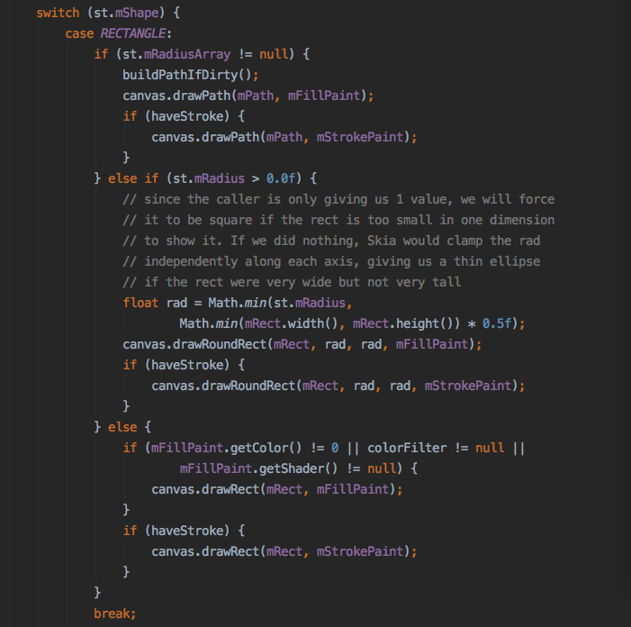

调用canvas.drawRect把mRect画出来，而mRect的赋值在ensureValidRect。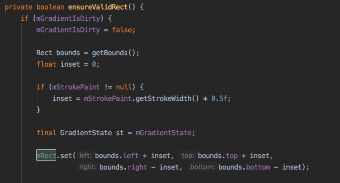

bounds在哪里设置的？答案是ImageView.updateDrawable内，会调用Drawable.getIntrinsicHeight赋值（从xml中size属性读取），再调用configureBounds -> setBounds，如果使用的不是ImageView，一定要在draw之前**调用setBounds**，否则size就会出错。

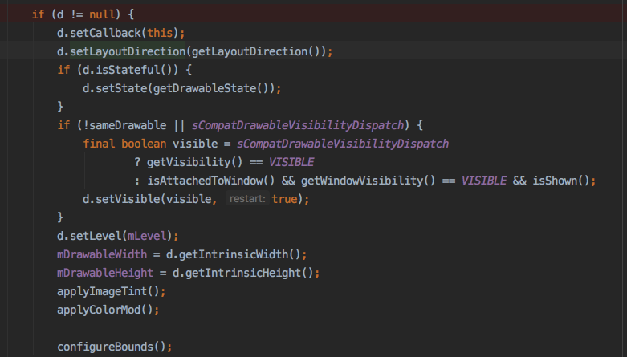

回到loadDrawableForCookie，再看一下6，7步加载图片的过程，通过AssetManager读取图片流数据，通过Drawable.createFromResourceStream这个我们经常使用的方法获取到Drawable。

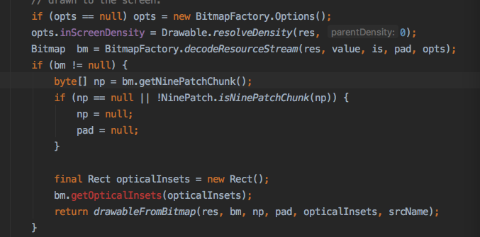

取到屏幕密度之后调用BitmapFactory.decodeResourcesStream，计算密度后调用native创建Bitmap，感兴趣的同学可以看下更具体的分析文章（如[理解Bitmap](https://zhuanlan.zhihu.com/p/31450987)）。

### 总结

本文探究了两点

- View.Canvas与new Canvas的区别。
- 创建Drawable的过程

### 参考资料

Android 7.1.1 源码

Android 官方文档，[Canvas and Drawable](https://developer.android.com/guide/topics/graphics/2d-graphics.html), [Drawable](https://developer.android.com/reference/android/graphics/drawable/package-summary.html)等

