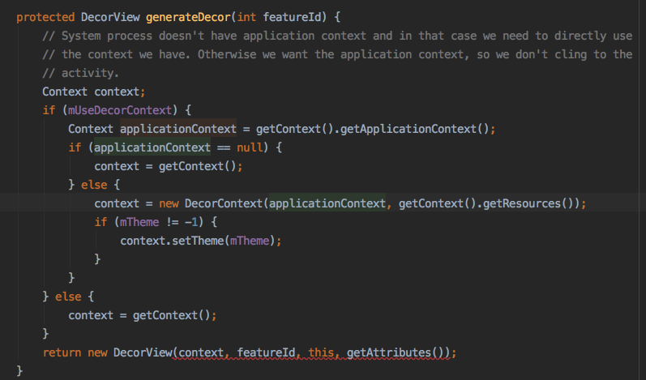
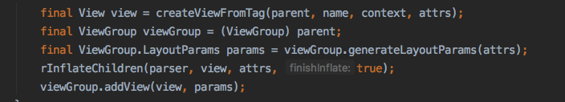
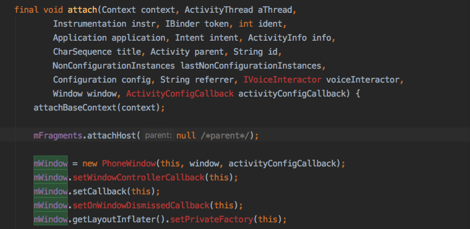
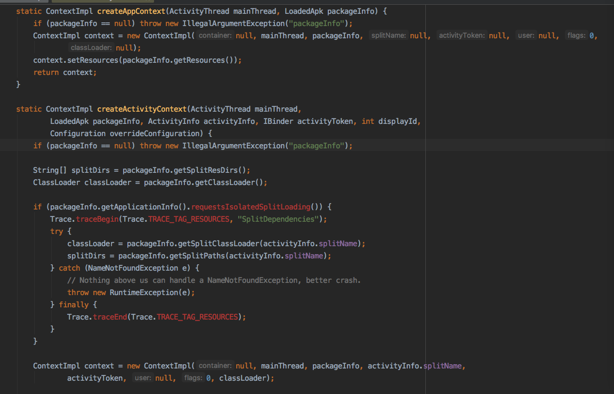
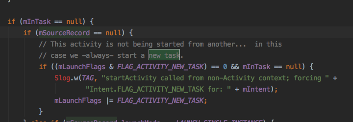
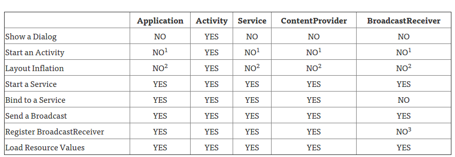

## 概述

在使用getContext方法的时候有没有想过，在不同的场景下，取到的Context到底有什么不同，View，Fragment，Activity和Application的getContext又究竟是怎么样？

下面来分析一下。

## 获取Context

### DecorView

DecorView的Context是Application Context。

ActivityThread.addView -> PhoneWindow.generateDecor

### View

一般View是从LayoutInflater类中inflate生成的，查看inflate方法，会调用rinflate

发现是入参Context，在inflate方法内赋值，其实最后就是LayoutInflater.from的参数Context。

所以结论是普通View是LayoutInflater.from的参数Context。

但是对于xml这样的布局文件里面的View又是怎么样的呢？

看一下Activity.setContentView方法的调用过程是:

Activity.setContentView -> PhoneWindow.setContentView -> LayoutInflater.inflate方法，而这个LayoutInflater是在PhoneWindow的构造方法内创建的，回到Activity.attach方法，看到构造方法的参数是Activity的Context。

于是增加一个结论，在xml中解析的View的Context属于Activity。

可能有人问，那Fragment也是吗？看一下Fragment.onCreateView中参数有LayoutInflater，跟踪一下

Fragment.onCreateView <- Fragment.performCreateView -> FragmentManagerImpl.moveToState <- Fragment.performGetLayoutInflater <- Fragment.getLayoutInflater <- FragmentHostCallback.onGetLayoutInflater

结果是用了FramgentHostCallback构造方法的参数Context

结论也是Activity的Context。

#### FragmentActivity

一般使用FragmentActivity.this和FragmentActivity.getContext方法取到Context，最终取到的都是Activity的Context，不再赘述。

### Fragment

通过Fragment.getContext取到Context，结果是取到FragmentHostCallback.getContext也是Activity的Context。

### Application

取到的是Application Context。

## Applicaiton与Activity的区别

所以最终的目的是区分Application与Activity的Context有什么不同。所以看它们各自的实现，Application与Activity都继承于ContextWrapper，ContextWrapper就是包装了一下抽象类Context，在构造方法里传入Context对象，根本在于构建Application和Activity的地方。

追踪一下发现Context构建都在ContextImpl类内，Application对应createAppContext，而Activity则对应createActivityContext，都在ActivityThread中调用各自创建Context方法进行初始化。

对比ContextImpl的构建，前三个参数都一致，Activity的Context多了activityToken和classLoder，其中activityToken对应ActivityRecord类，接着调用Context.setResource方法设置Activity的配置和逻辑显示相关的信息Display。

看一下这个熟悉的错误，这个是使用Application的Context启动Activity时报的错误，这个mSourceRecord就是AcitivityRecord对象，对于Application而言为null，所以需要指定New_Task这个标志。

两者之间更重要的一个区别是：生命周期。

对于Application的Context而言，在整个应用的生命周期内都不会改变；而对于不同的Activity，其Context有可能不同，例如添加一个Dialog必须附着在Activity上，所以使用Application就会报错。

下图来源于[Stackoverflow](https://stackoverflow.com/questions/4128589/difference-between-activity-Context-and-Application-Context)

## 总结

除了Application，DecorView和getApplicationContext方法会取到Application Context外，其他方法getContext都会取到Activity Context或者传入的Context。

一般来说，Application Context存在于整个应用的生命周期中，不会随场景变化而改变，所以对于打开不同的Activity，Activity Context可能存在不同，而且生命周期跟Activity的生命周期一致。