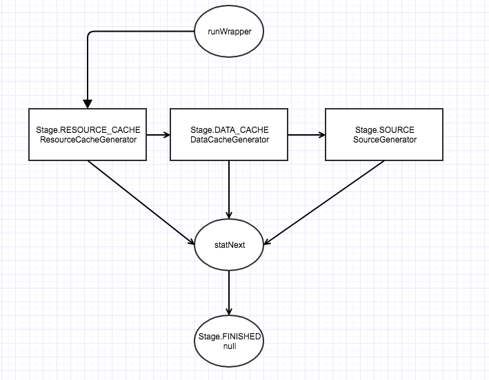

## 概述

目前最新版Glide 4.6.1已发布，跟之前版本对比，变动颇大。

源码不少，所以分模块分析，文章也分开来写，条理比较清晰。

大体流程分析 -> 加载算法分析 -> 缓存池使用 -> 生命周期和设计思想 -> 查遗补漏

本章主要解析图片加载库的最核心部分，图片加载逻辑的流程。

图片加载需要考虑和兼顾各个方面：

- 大图片如何加载，如何避免OOM
- 图片加载过程需要显示holder
- 如何分配缓存
- 线程池和对象池的设计和使用
- 网络资源的分配
- 图片的生命周期等

Glide作为一个非常优秀的图片加载框架，对上述问题都解决得相当漂亮。

在阅读本文之前，建议先阅读[Glide官方指南](https://bumptech.github.io/glide/)。

## 核心模块

### 从普通调用说起

Glide新版本的调用有所改变，可以通过注解生成的`GlideApp`来作为入口，原先的`Glide`也能用，只是API有所变化，这里用GlideApp作为例子。

```java
GlideApp.with(imageview.getContext()).load(path).placeholder(R.drawable.placeholder).centerCrop().override(width, height).into(imageview);
```

这种流式调用非常爽快，最终调用落在GlideRequest.into方法中。

`RequestBuilder.into`


target是一个重要的概念——Glide用于显示placeholder、决定尺寸大小、加载资源和响应生命周期的接口。一般实现是ImageViewTarget及其子类，通过ImageViewTargetFactory.buildTarget生成，默认是DrawableImageViewTarget，它包装一个ImageView，当加载失败和初始化的时候，会显示placeHolder，资源加载成功则直接显示。

Request构建完后，它进行了一次比较，用于处理类似RecycleView快速滚动时，重用ImageView时显示出旧request加载的图片，若不等则调用clear方法并重新开始加载，若相等则用旧request加载，recycle掉新request，这个request是通过setTag来实现的。

下面是真正开始加载的流程


从调用上看，最后落到的是Engine.load方法。

### 图片加载

Engine.load方法所做的事

- 检查当前列表中是否存在活跃资源，存在则返回；不活跃的资源则被移进内存缓存
- 检查是否能使用内存缓存，存在则返回
- 检查是否有正在加载中的图片，有则返回
- 开始一个新的加载过程

活跃资源是指一个请求至少被加载成功一次且未被释放，一旦消费者把资源释放掉，则会移入缓存。如果从缓存中加载资源，则资源会变活跃。如果资源从缓存中移除，会被重用。对于消费者而言，没有强制要求释放资源，所以活跃资源都以弱引用的方式持有。

#### loadFromActiveResource

上述第一步

`engine.loadFromActiveResources`


主要看loadFromActiveResources方法返回是否为空，不为空加载流程直接返回结果。

查看方法源码，调用了ActiveResource.get方法

`ActiveResources.get`


activeEngineResources声明如下，ResourceWeakReference是一个WeakReference<EngineResource<?>>

```java
final Map<Key, ResourceWeakReference> activeEngineResources = new HashMap<>();
```

通过key来获取是否存在活跃的WeakReference，印证了加载的第一步。

再看一下活跃资源是怎么被移除了，通过ActiveResource.deactive方法，调用时机是

`engine.onResourceReleased`

资源被释放时将其移除活跃状态并置入缓存，得证。

#### loadFromCache

上述第二步

`engine.loadFromCache`


cache列表是一个LruCache，是一个LinkedHashmap，简单来说就是拥有双端指针的有顺序的HashMap，一个指针指向用得多的头另一个用得少的尾，超出size则删除尾项，这里不展开。

而cache存在时，则把资源从cache移除，放进活跃队列。

#### getJob

上述第三步

`Engine.getjob`


很简单，检查当前正在加载的任务中，存在则加上回调并返回。

#### startEngineJob

上述第四步

`engine.startJob`


新建engineJob和decodeJob，往当前正在加载列表里添加任务，开始执行！

EngineJob实际上是一个线程池的持有者，它控制任务执行和回调函数，而真正执行任务的是DecodeJob。

`engine.start`


start方法里调用了decodeJob.wllDecodeFromCache，比较关键。

`decodeJob.willDecodeFromCache`


getNextStage里调用diskCacheStrategy.decodeCachedResource来判断，这也是我们可以指定不同diskCacheStrategy的方便之处，默认使用的是DiskCacheStrategy.AUTOMATIC，decodeCachedResource默认返回true。

所以Engine.start方法使用的是diskCacheExecutor线程池来执行任务，默认线程数为1（核心线程和最大线程池数都为1，具体查看GlideExecutor.newDiskCacheExecutor）。

真正任务执行时DecodeJob，实际上是个Runnable，看一下run方法，其中核心功能是runWrapper。

`DecodeJob.runWrapped`


RunReason是任务执行的状态，一共三种，INITIALIZE，SWITCH_TO_SOURCE_SERVICE，DECODE_DATA，初始态是INITIALIZE。它跟DecodeJob.Stage的状态不同，后者是标记解码的来源。

`DecodeJob.runGenerators`


DecodeJob.runGenerators方法通过DataFetcherGenerator的startNext返回false作为循环条件，根据stage的状态，选择不同的Generator来解码数据。



上面stage共有三种有效状态和一个结束态，下面一个个来看，先是ResourceCacheGenerator。（注：当加载GIF图片时，默认采用的DiskCacheStrategy.NONE，所以直接从SourceGenerator开始）。

##### ResourceCacheGenerator

从缓存数据中取到已缩放/已转码的资源。举个例子，如果传入是String类型的绝对路径，原图片大小1.5MB（1920 * 1080），这里取到的会是压缩且裁剪过的图，大约10KB左右（180 * 180）。

`ResourceCacheGenerator.startNext`


通过源文件的绝对路径currentKey从DiskLruCacheWrapper（默认缓存文件夹大小为250MB，目前只用了InternalCacheDiskCache）中取到缓存文件cacheFile，通过DecodeHelper.getModelLoaders取到能加载这个cacheFile的loader，一共有三种分别是ByteBufferFileLoader，FileLoader，UnitModelLoader，按顺序处理，任一个处理完毕之后返回。

最后一步通过modelLoader.buildLoadData包装出ModelLoader.LoadData对象，其fetcher为ByteBufferFileLoader，再看loadData方法。

`ByteBufferFileLoader.loadData`


从File内读取数据，根据结果回调成功或失败，失败则使用其他loader继续加载，其他的FileLoader和UnitModelLoader的处理感兴趣的可以自己看下。

成功和失败的回调在DecodeJob里

`DecodeJob.onDataFetcherReady`


注意，某个loader失败并不会在回调到最外层，而是在runGenerators里根据stage是否到FINISHED状态再回调，未未FINISHED则继续进行下一步处理。

##### DataCacheGenerator

从缓存中获取原始数据，对于本地资源而言没用到。

##### SourceGenerator

从原始数据使用已注册的ModelLoaders生成DataFetchers，同时生成加载生成的Model。

已注册的ModelLoaders可以从Glide的构造方法里找到，也可以调用append自己添加，第一个参数是load的类型，第二个参数是中间数据类型，最后一个是ModelLoaderFactory，工厂方法通过build生成ModelLoader。

`Glide.Glide`


继续使用选择String作为例子。

`SourceGenerator.startNext`


看一下loadData怎么来的

`DecodeHelper.getLoadData`


取到的modelLoader是StringLoader类型，LoadData是由StringLoader.buildLoadData生成，而StringLoader.uriLoader是由MultiModelLoaderFactory.build方法生成的内部类MultiModelLoader，调用MultiModelLoader.buildLoadData方法，真正返回一个LoadData。

LoadData又持有MultiFetcher，当SourceGenerator.startNext调用loadData.fetch.loadData方法，实际是循环MultiFetcher里的Fetcher，最终由StreamLocalUriFetcher.loadData通过ContextResolver.openInputStream返回一个InputStream。

`StreamLocalUriFetcher.loadResourceFromUri`


将结果通过onDataReady回调给SourceGenerator，由于getDataSource是LOCAL，对于DiskCacheStrategy.isDataCacheable只有Remote才返回true，所以回调到DecodeJob.onDataFetcherReady -> decodeFromRetrievedData -> decodeFromData -> decodeFromFetcher -> runLoadPath -> LoadPath.load -> loadWithExceptionList -> decode -> decodeResourceWithList -> notifyEncodeAndRelease（结束）。

`DecodePath.decodeResourceWithList`


循环decodePaths列表里的ByteBufferGifDecoder，ByteBufferBitmapDecoder和BitmapDrawableDecoder分别调用decode方法，其中任意处理了，就可以返回。

若图片不是GIF，则走到ByteBufferBitmapDecoder.handles方法默认返回true，则调用其decode方法即downsampler.decode方法，这就是压缩/裁剪图片的核心方法，原来Glide也是通过原生Android提供的API的实现的！先不管具体算法实现，算法太长，先挖坑后面另开篇章讲。

看解码完毕之后的操作

`DecodeJob.onResourceDecoded`


这里走的是ResourceCacheKey，然后init，encoder是BitmapEncoder。

DecodeJob.decodeFromData结束后，返回非空的Resource后，调用notifyEncodeAndRelease完成最后的工作。

`DecodeJob.notifyEncodeAndRelease`


resource参数是包装类LazyBitmapDrawable（调用get方法时才生成BitmapDrawable），通过LockedResource处理返回了BitmapDrawable，回调到外层target.onResourceReady，调用fetcher.cleanup做清理工作。

当图片加载完成后调用DecodeJob.notifyEncodeAndRelease -> encode -> DiskLruCacheWrapper.put -> DataCacheWriter.write -> BitmapEncoder.encode，再次进行压缩后再将文件根据key/value形式缓存起来。

这样整个加载流程就走完了。

## 总结

Glide是一个优秀且复杂的图片加载框架。本文并没有完全解决开头所提的每个问题，只是对整个图片加载的流程做了大体的概括，更具体的细节需要一点点阅读源码。

后面的章节会分析图片加载算法。