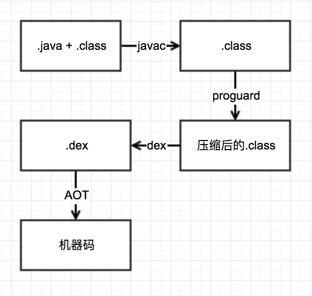
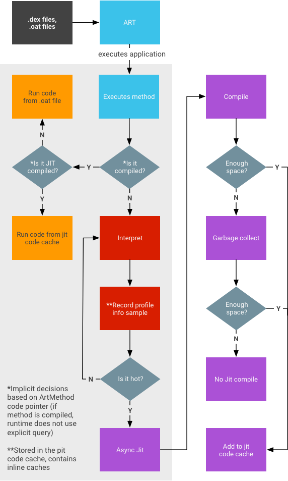
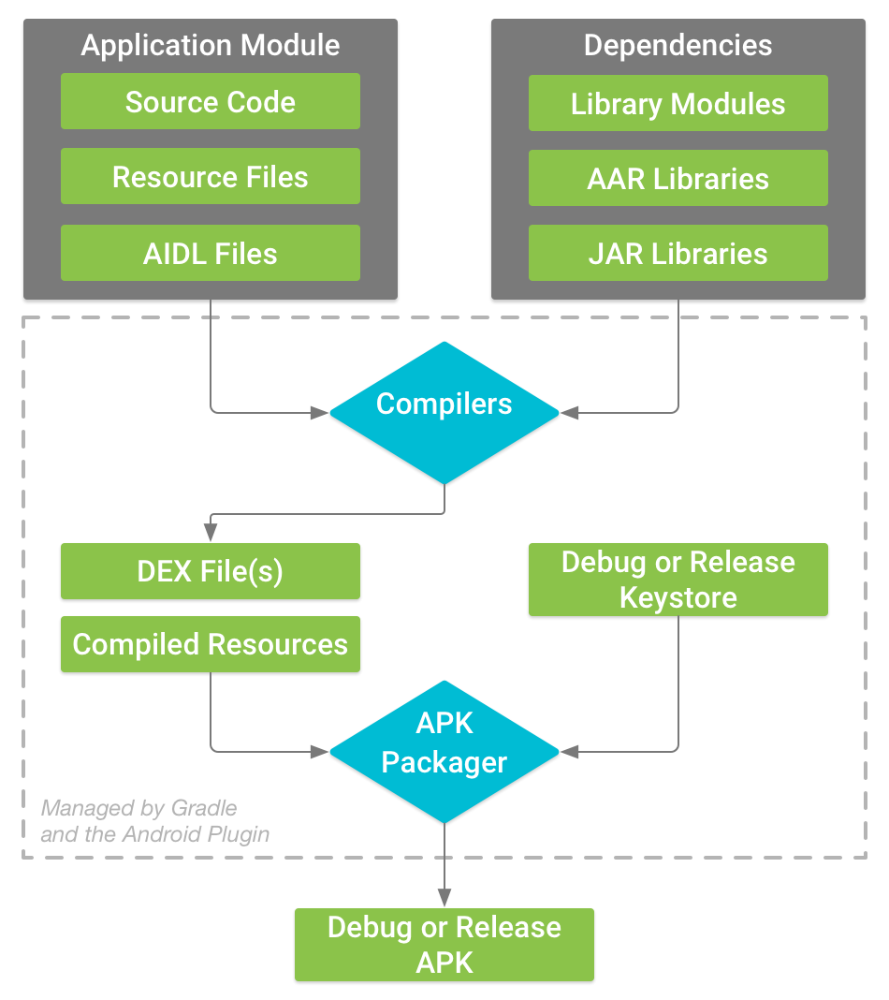
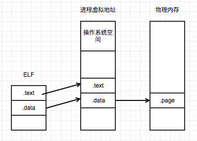

## Androd运行环境

标准Java编译器使用JIT技术（见注1）将源代码编译成字节码（.class文件），紧接着进行第二轮编译（是对字节码进行压缩）出的字节码可以在特定的JVM运行。对于Android会有两个不同的虚拟机：

- DALVIK：对于Android 4.4及以下版本使用的虚拟机，它使用JIT编译技术，但是在应用打开时进行编译，将应用启动速度变慢。
- ART：应用AOT（ahead-of-time）技术在应用安装时将一部分的字节码转化成机器码，因此应用的启动速度变快。同时ART对GC技术进行了优化，默认采用CMS（并发标记和删除，见注2）缩短用户等待的时间。ART也存在缺点：会使安装速度变慢，因为缓存了机器码导致应用占用空间变大。

## Android编译过程

更详细的编译补充过程见注3。

#### 编译字节码

Android应用需要JDK来编译Java文件，通过javac命令来编译我们所写的代码，包括运行时的预编译类和三方库，输出字节码。这个步骤是一般的Java步骤，接下来才是Android特色的东西。

#### 混淆（ProGuard Tool）

这个步骤是选择性开启的。Proguard Tool获取上述步骤输出的字节码，将其压缩（移除没人调用的方法）和混淆（将类名映射为无意义的名字）。

混淆大量减少包名，同时让破解者的成本大大提升。

不管用不用Proguard，这个步骤最后输出的也是.class文件（使用了就是混淆过的.class文件）。

#### .class字节码转化dex字节码

取到上一步输出的字节码将其转化为dex字节码（Dalvik Executable）。dex字节码是经过优化后的代码，能在Dalvik和ART运行时执行。

#### 打包Apk并签名

将上一步输出的dex字节码和资源文件通过aapt一并压缩到apk内，通过jarsigner（标准签名工具）或zipalign（将字节码对齐）等工具进行签名。

#### 运行apk

Zygote进程负责启动app。Zygote进程包含了所有应用公用的核心仓库，使用linux系统的fork命令来创建（非常快）一个自己的复制进程用于运行apk，这种方法会比启动新一个新进程再加载系统文件快得多。

#### 执行机器码

Android运行时会读取上一步输出apk中的dex字节码，为了获得更快的执行速度，需要重新编译成机器码，可以成为ELF文件，在Android平台上是OAT文件。OAT文件会通过页映射到进程的内存里，然后把CPU执行入口地址改为该进程的内存地址开始执行（见注4），具体可以参考《程序员的自我修养—链接、装载与库》。

在Dalvki上这步在应用启动时使用JIT技术实现；

而在ART上，这步发生在app安装时，所以当启动应用时，速度会更快。

到这里位置，应用就启动主Activity并显示到屏幕上，具体可参考应用启动流程。

## 总结

从编写Java代码开始，经过一系列转换和编译，最终生成Android能执行的机器码，这个中间发生的东西还有很多，这里给了个大体流程。

## 注

#### 1.JIT

Android 运行时 (ART) 包含一个具备代码分析功能的即时 (JIT) 编译器，该编译器可以在 Android 应用运行时持续提高其性能。JIT 编译器补充了 ART 当前的预先 (AOT) 编译器的功能，有助于提高运行时性能，节省存储空间，以及加快应用及系统更新速度。相较于 AOT 编译器，JIT 编译器的优势也更为明显，因为它不会在应用自动更新期间或重新编译应用（在无线下载 (OTA) 更新期间）时拖慢系统速度。

- 用户打开应用，会另ART加载.dex文件：如果有.oat文件（.dex文件的AOT二进制文件），ART则会使用该文件；若果没有则使用JIT解释执行.dex文件
- 针对未编译的应用启动JIT
- 将JIT数据转存在只限应用访问的目录
- AOT编译守护进程通过解析该文件来推动编译。

图片来自Android官方文档

#### 2.CMS

CMS是以获取最短回收停顿时间为目标的收集器。整个过程分为初始标记，并发标记，重新标记和并发清除，其中1和3都需要阻塞主线程来标记GC Root能关联的对象，而并发标记和并发清除是耗时最长的步骤。其缺点有：较为占用CPU，无法清除浮动垃圾和无法整理空间碎片。

#### 3.构建流程

图片来自Android官方文档

#### 4.装载

图片来自《程序员的自我修养—链接、装载与库》

左边的ELF文件就是Android下执行的OAT文件，它按读写权限划分，具体分为.text代码段，.data数据段；中间是进程的虚拟地址空间，在Android下是Zygote fork出来的进程；右边是物理内存空间。

整个流程大概是，创建进程的虚拟地址空间并映射物理空间，建立ELF文件与虚拟空间的映射关系，开始执行。

具体请参考《程序员的自我修养—链接、装载与库》。

### 参考资料

[Understanding the Android CompilationProcess -- By Bhavya Doshi](http://www.theappguruz.com/blog/android-compilation-process)

[ART和Dalvik](https://source.android.com/devices/tech/dalvik/)

[How Android Apps are Built and Run](https://github.com/dogriffiths/HeadFirstAndroid/wiki/How-Android-Apps-are-Built-and-Run)

[Build and Run](https://developer.android.com/studio/build/index.html)

《程序员的自我修养—链接、装载与库》

《深入理解Java虚拟机》