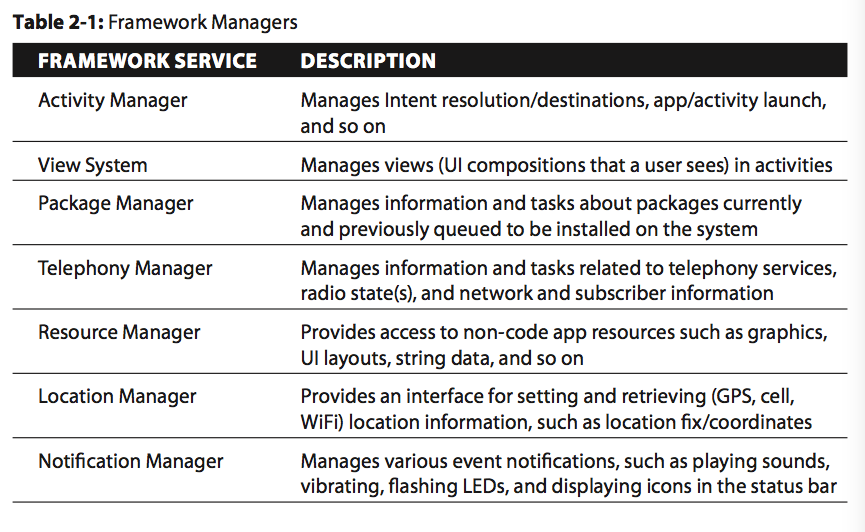
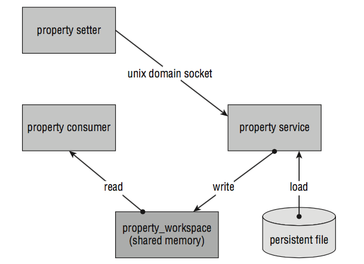
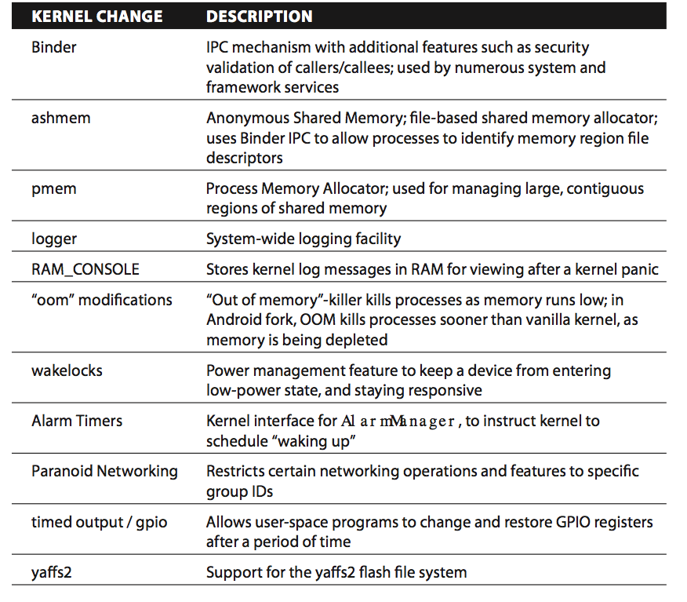
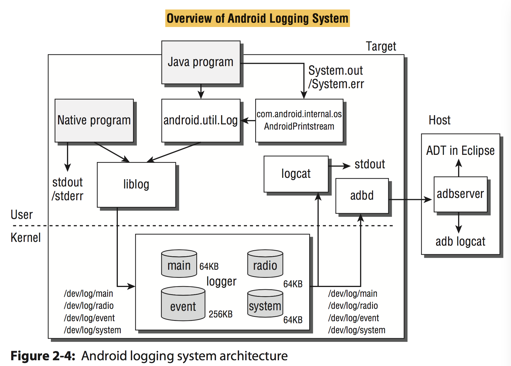

了解各个层级的组成，对于评估应用安全性或者进行某种攻击，是非常必要的。这个章节讨论的话题是，应用组成部件的安全性，运行时以及进程间通信的机制。

### Android应用层

- AndroidManifest
  - 唯一包名和版本号
  - Activity, Service, BroadCast Receiver, Instrumentation定义
  - 需要权限的声明
  - 依赖第三库的声明
  - 优先安装位置以及UI信息


- Intent：应用内通信的关键。需要关注其携带内容信息，目标组件，标志flag和权限需求。
- Activities：界面元素，更需要关注ActivityManager。
- Broadcat Receivers：应用间通信的另一种方式。需要关注其权限需求。
- Services：除了应用启动的Services外，还需要关注系统的公用Service如蓝牙和短信服务。
- ContentProviders：获取公用数据的接口，需要关注权限需求。

### Android Framework

应用层和运行时的粘合剂，提供UI，公用数据，信息传递功能和与应用无关的代码。例如android.\*，android.content或java.\*等。

除此之外，Framework还通过各种manager来管理服务，而下表列出的manager都是由system_server启动。



通过ps命令，可以看到manager的PPID都是system_server的PID。

### Dalvik虚拟机

Dalvik是基于寄存器而不是基于栈的。它专门为嵌入式系统设计，本省是高效而快速的，但是，虚拟机毕竟是底层CPU寄存器的抽象，这导致了效率的损耗，这也是谷歌竭力来消除这部分影响的原因。

为了高效，DEX文件在被虚拟机解析之前就被已经被优化了。对于Android应用内加载DEX文件，这仅会发生在应用第一次加载的时候（在ART是应用安装时加载）。

#### Zygote

Android设备启动时执行的程序之一，第一个作用是负责启动各种附加服务和Android Framework需要的libraries。

Zygote通过创建自身的复制，作为每个Dalvik进程的loder。这种优化策略避免重复加载资源的额外损耗。因此，核心库，类文件和heap架构的Dalvik进程实例都是一样的。

第二个作用是启动system_server进程。system_server进程运行了拥有特权AID的核心服务，也就是启动上面表格中的Android Framework Manager。

### User-Space Native Code

是Android的重要组成部分，由Libraries和系统核心服务组成。

#### Libraries

通过JNI，Android Frameword中高层级的功能可以调用低层级的实现。例如本地数据存储库SQlite；嵌入式浏览器引擎Webkit等，一般存放在`/system/lib` 目录下。

#### 核心服务

核心服务是指初始化底层操作系统环境和原生Android组件，这些环境包括初始化时启动init进程，和提供各种关键功能例如，debuggerd和adbd。

##### init

在Android系统上，user-space进程通过Linux内核启动的第一个命令就是init。和其他Linux系统相似，init程序执行一系列命令进行user-space环境初始化，其执行文位于`/init.rc`。（总的流程：开机->Boot Process->init->Zygote->System Server->System Process->User Process）

通过`cat /init.rc`或`cat /etc/init.rc`查看

```xml
...
service servicemanager /system/bin/servicemanager
    class core
    user system
    group system
    critical
    onrestart restart zygote
    onrestart restart media
    onrestart restart surfaceflinger
    onrestart restart drm

service vold /system/bin/vold
    class core
    socket vold stream 0660 root mount
    ioprio be 2

service netd /system/bin/netd
    class main
    socket netd stream 0660 root system
    socket dnsproxyd stream 0660 root inet
    socket mdns stream 0660 root system
...
```

init执行的任务包括

- 初始化必须的Service
- 根据参数，指定每个Service下应该运行的用户和用户组
- 通过Property Service设置全局环境变量
- 注册指定事件的监听，例如修改系统属性或挂载文件系统

#####  Property Service

在init进程中，提供持久化，内存对应的键值对形式的配置参数。包括网络接口参数，音频参数和安全相关设置都依赖这些配置参数。



通过`getprop`或`setprop`获取和设置。

```xml
[androVM.inited]: [1]
[androVM.vbox_dpi]: [320]
[androVM.vbox_graph_mode]: [768x1280-16]
[dalvik.vm.heapgrowthlimit]: [64m]ces.txt]
[dev.bootcomplete]: [1]
...
[dhcp.eth1.dns3]: []
[genyd.ac.online.cached]: [1]
[genyd.battery.full.cached]: [50000000]
[genyd.device.id]: [000000000000000]
...
[init.svc.vold]: [running]
[init.svc.zygote]: [running]
[keyguard.no_require_sim]: [true]
[net.bt.name]: [Android]
...
[net.tcp.buffersize.wifi]: [524288,1048576,2097152,262144,524288,1048576]
[persist.service.adb.enable]: [1]
...
[ro.allow.mock.location]: [0]
[ro.boot.hardware]: [vbox86]
[ro.bootloader]: [unknown]
```

以ro打头的是只读属性，不能被修改。

##### Volume Daemon

又被称为vold，负责挂载和卸载Android文件系统。例如，当插入SD卡时，vold进程捕获到相关事件，将卡挂载到合适的路径（/mnt/sdcard ）。当SD卡被拔掉或被手动拒绝，vold会把目标卡卸载。

### Kernel

接下来会讨论Android对标准的Linux Kernel做了一些修改。



#### Binder

最重要的特性之一，提供IPC机制，允许同步调用另一个进程中的方法。由于Binder机制的复杂性和篇幅所限，这边先不作讨论。

####  ashemem

匿名共享内存（Anonymous Shared Memory）。ashemen是一个基于文件的，引用计数的共享内存接口。由于ashmem目的就是当系统可用内存不足时自动收缩和回收内存，在Android核心组件中颇为流行，如Surface Flinger， Audio Flinger，System Server和DalvikVM。

#### Logger

Android kernel仍然使用基于Linux的kelnel-logging机制，同事它也使用另外被称为logger的子系统。logger通过logcat命令，用于查看日志信息，其中包括四种类型：main，radio，event和sustem。



其中main输入的日志最多，它也是应用日志输出的来源。应用通过android.util.Log指定日志的优先级，Log.i代表information，Log.d代表debug，Log.e代表error（分级与syslog一致）。

系统进程打印的日志也传达出很多信息，它们通过android.util.Slog的native方法println_native，调用native code输出日志。

### 总结

回头看Android设计和架构一眼，这是多复杂的一个系统啊。

基于最小特权法则，应用只能申请它所需要的最小权限，提高安全性的同时，也增加了复杂性，再加上系统安全的基石——进程隔离和降权操作，无论是开发者还是攻击者，都加大了开发的难度。当攻击者想谋划一次攻击前，必须花时间完全理解这其中的复杂性。

仁者见仁，智者见智。			


​		
​	